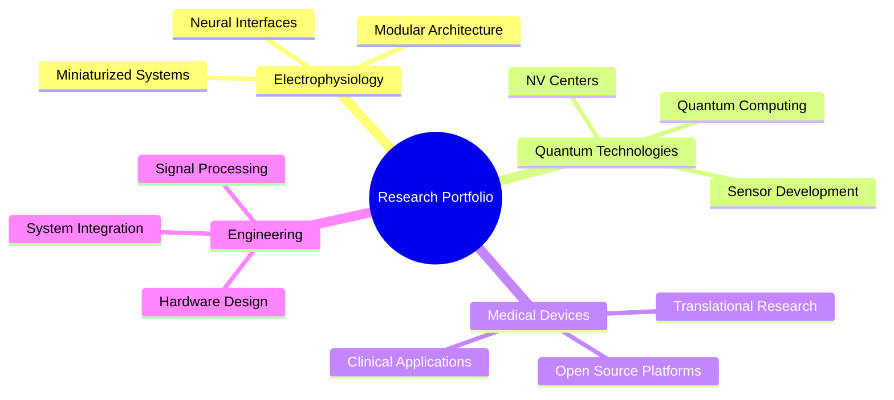

<div align="center">


</div>

<div align="center">

[](https://git.io/typing-svg)

</div>

---

<div align="center">

### 🎓 **ACADEMIC PROFILE**

</div>

<table align="center">
<tr>
<td align="center" width="50%">

**🏛️ INSTITUTIONAL AFFILIATION**
<br>

<br><br>
**📋 POSITION**
<br>


</td>
<td align="center" width="50%">

**🔬 RESEARCH DOMAIN**
<br>

<br><br>
**🎯 SPECIALIZATION**
<br>


</td>
</tr>
</table>

---

<div align="center">

### 🔬 **RESEARCH FOCUS & EXPERTISE**

</div>

<div align="center">



</div>

<table align="center" width="100%">
<tr>
<td align="center" width="25%">

<br><sub><b>Miniaturized Neural Interfaces</b></sub>
</td>
<td align="center" width="25%">

<br><sub><b>NV Center Technologies</b></sub>
</td>
<td align="center" width="25%">

<br><sub><b>Translational Engineering</b></sub>
</td>
<td align="center" width="25%">

<br><sub><b>Collaborative Platforms</b></sub>
</td>
</tr>
</table>

---

<div align="center">

### 💻 **TECHNICAL PROFICIENCY MATRIX**

</div>

<div align="center">

<table>
<tr>
<td align="center"><b>🐍 Programming Languages</b></td>
<td align="center"><b>🔧 Engineering Tools</b></td>
<td align="center"><b>📊 Data & Analysis</b></td>
</tr>
<tr>
<td align="center">


<br>


<br>

</td>
<td align="center">

<br>

<br>

</td>
<td align="center">

<br>

<br>

</td>
</tr>
</table>

</div>

---

<div align="center">

### 📊 **RESEARCH ACTIVITY ANALYTICS**

</div>

<div align="center">


</div>

<div align="center">


</div>

---

<div align="center">

### 🏆 **ACHIEVEMENT PORTFOLIO**

</div>

<div align="center">


</div>

---

<div align="center">

### 📈 **COMPREHENSIVE DEVELOPMENT METRICS**

</div>

<div align="center">


</div>

<div align="center">


</div>

<div align="center">


</div>

---

<div align="center">

### 🔬 **LANGUAGE & TECHNOLOGY DISTRIBUTION**

</div>

<div align="center">


</div>

<div align="center">

```python
# Research Technology Stack
research_stack = {
    "Hardware": ["Electrophysiology Systems", "PCB Design", "Sensor Integration"],
    "Software": ["Signal Processing", "Data Acquisition", "Real-time Analysis"],
    "Quantum": ["NV Centers", "Quantum Sensing", "Magnetic Field Detection"],
    "Medical": ["Neural Interfaces", "Biocompatible Materials", "Clinical Translation"]
}
```

</div>

---

<div align="center">

### 📊 **PROFESSIONAL METRICS DASHBOARD**

</div>

<div align="center">


</div>

<div align="center">

### 🤝 **RESEARCH COLLABORATION**

</div>

<div align="center">

<table>
<tr>
<td align="center">

**🔬 Open Science Initiatives**
<br>

<br>
<sub>Committed to reproducible research and collaborative innovation</sub>

</td>
<td align="center">

**🌐 Academic Network**
<br>

<br>
<sub>Fostering interdisciplinary partnerships in neurotechnology</sub>

</td>
<td align="center">

**📚 Knowledge Transfer**
<br>

<br>
<sub>Bridging academic research with practical applications</sub>

</td>
</tr>
</table>

</div>

---

<div align="center">


</div>

<div align="center">

*"Bridging the gap between cutting-edge neuroscience and practical medical solutions through innovative engineering and collaborative research."*

</div>
