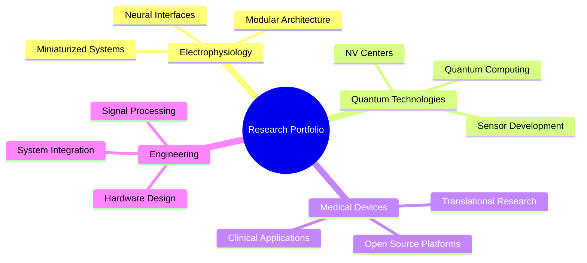

<h1>

</h1>

---

### 🔬 **PROFESSIONAL OVERVIEW**

<table width="90%">
<tr>
<td align="center">

I specialize in developing **miniaturized electrophysiology systems** and **quantum sensing technologies** for next-generation neural interfaces. My work focuses on creating modular, scalable solutions that bridge the gap between cutting-edge quantum physics and practical neurotechnology applications.

**Core expertise** includes designing ultra-compact neural recording devices, implementing **nitrogen-vacancy (NV) center** quantum sensors for magnetic field detection, and developing open-source platforms for translational medical device research.

My research contributes to advancing **precision neuroscience** through innovative hardware-software integration, enabling new possibilities in brain-computer interfaces, neuroprosthetics, and quantum-enhanced biosensing systems.

</td>
</tr>
</table>

### 🔬 **RESEARCH FOCUS & EXPERTISE**

<table align="center" width="100%">
<tr>
<td align="center" width="25%">

 <b>Miniaturized Neural Interfaces</b>
</td>
<td align="center" width="25%">

 <b>NV Center Technologies</b>
</td>
<td align="center" width="25%">

 <b>Translational Engineering</b>
</td>
<td align="center" width="25%">

 <b>Collaborative Platforms</b>
</td>
</tr>
</table>

### 💻 **TECHNICAL PROFICIENCY MATRIX**

<table>
<tr>
<td align="center"><b>🐍 Programming Languages</b></td>
<td align="center"><b>🔧 Engineering Tools</b></td>
<td align="center"><b>📊 Data & Analysis</b></td>
</tr>
<tr>
<td align="center">

 

 

</td>
<td align="center">

 

 

</td>
<td align="center">

 

 

</td>
</tr>
</table>

### 🏆 **ACHIEVEMENT PORTFOLIO**

---

### 📈 **COMPREHENSIVE DEVELOPMENT METRICS**

### 🔬 **LANGUAGE & TECHNOLOGY DISTRIBUTION**

---
